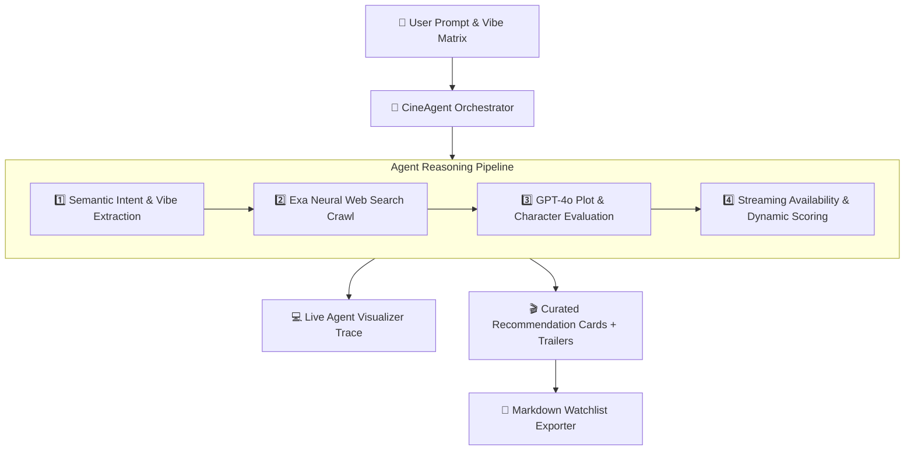

<div align="center">

# 🎬 CineAgent

### *Personalized Movie Recommendation Agent Powered by Exa Neural Search & GPT-4o*

<p align="center">
  <a href="https://github.com/Ishant6565/CineAgent"></a>
  <a href="https://github.com/Ishant6565/CineAgent/stargazers"></a>
  <a href="https://github.com/Ishant6565/CineAgent/network/members"></a>
  <a href="https://github.com/Ishant6565/CineAgent/blob/main/LICENSE"></a>
</p>

<p align="center">
  
  
  
  
  
  
  
</p>

<p align="center">
  <b>An autonomous AI agent engineered to find the exact movie matching your emotional wavelength, visual aesthetic, and narrative pacing.</b>
</p>

---

</div>

## 🌟 Overview & Highlights

**CineAgent** is a next-generation AI agent that combines **Exa Neural Search** (to crawl film discourse, reviews, Letterboxd, IMDb, Rotten Tomatoes) with **GPT-4o Multi-Step Agent Reasoning** to evaluate plots, character dynamics, cinematic aesthetics, and emotional resonance.

- 🧠 **Multi-Step Agent Reasoning Pipeline**: Live step-by-step chain-of-thought trace visualization.
- 🎭 **Taste & Aesthetic Matrix**: Dynamic filters for emotional mood, narrative pacing (Slow-Burn to Fast-Paced), release era, and streaming platforms (Netflix, Max, Prime, Apple TV+, etc.).
- 🍿 **Rich Intelligence Cards**: High-res cinematic backdrops, match scores (%), personalized "Why You'll Love It" AI rationales, and YouTube trailer modals.
- 💾 **Personalized Watchlist & Markdown Exporter**: Save bookmarked films with `localStorage` and 1-click Markdown export.
- ⚡ **Minimalist Monochrome Theme**: Ultra-clean luxury black and white aesthetics with high-contrast typography.
- 🐍 **Standalone Python CLI Agent**: Full-featured terminal agent script.

---

## 🏛️ System Architecture



---

## 🐍 Terminal CLI Agent Usage

You can run the recommendation agent directly from your terminal!

### 1. Install Dependencies
```bash
pip install -r requirements.txt
```

### 2. Run CLI Queries

```bash
# Cyberpunk & Futuristic neo-noir query
python agent.py --query "Cyberpunk neo-noir" --mood "Cyberpunk / Futuristic"

# Mind-bending psychological thrillers with streaming filter
python agent.py --query "Mind-bending psychological thriller" --platform "Netflix" --top-k 3

# Export raw JSON output
python agent.py --query "Cozy anime fantasy" --json
```

---

## 🚀 Web Application Setup (Local)

### 1. Clone & Install
```bash
git clone https://github.com/Ishant6565/CineAgent.git
cd CineAgent
npm install
```

### 2. Start Local Development Server
```bash
npm run dev
```
Open **[http://localhost:5173](http://localhost:5173)** in your browser.

### 3. Build for Production
```bash
npm run build
```

---

## ⚙️ Environment Variables (Optional)

Create a `.env` file in the root directory if you wish to connect live external APIs:

```env
OPENAI_API_KEY=your_openai_api_key_here
EXA_API_KEY=your_exa_api_key_here
```

*(Note: The web app also provides a built-in Settings modal in the top navigation bar to configure API keys locally in browser storage, or runs in Zero-Config Instant Demo mode).*

---

## 📁 Project Structure

```
CineAgent/
├── src/
│   ├── components/
│   │   ├── Navbar.tsx             # Header navigation & Ishant6565 branding
│   │   ├── HeroAgentPrompt.tsx    # Natural language prompt & preset pills
│   │   ├── MoodMatrix.tsx         # Mood, era, pacing, platform filter matrix
│   │   ├── AgentVisualizer.tsx    # Real-time agent chain-of-thought terminal
│   │   ├── MovieCard.tsx          # Interactive movie card with AI rationale
│   │   ├── MovieGrid.tsx          # Responsive grid & sort controls
│   │   ├── TrailerModal.tsx       # YouTube trailer video modal
│   │   ├── WatchlistDrawer.tsx    # Saved films & markdown exporter
│   │   ├── SettingsModal.tsx      # API key & LLM model configuration
│   │   └── Footer.tsx             # Footer credits
│   ├── data/
│   │   └── mockMovies.ts          # Curated high-intelligence movie database
│   ├── services/
│   │   └── agentEngine.ts         # Exa search & GPT-4o recommendation engine
│   ├── types/
│   │   └── movie.ts               # TypeScript data definitions
│   ├── App.tsx                    # Main app coordinator
│   └── index.css                  # Minimalist black & white monochrome styling
├── agent.py                       # Standalone Python CLI Agent
├── requirements.txt               # Python dependencies
├── .env.example                   # Environment configuration template
├── package.json                   # Project metadata
└── README.md                      # Project documentation
```

---

## 📤 Push to GitHub Guide

To push this repository to your GitHub account:

```bash
# 1. Initialize Git (if not already initialized)
git init

# 2. Add all files and commit
git add .
git commit -m "feat: release CineAgent AI by Ishant6565"

# 3. Rename branch to main
git branch -M main

# 4. Link your remote repository
git remote add origin https://github.com/Ishant6565/CineAgent.git

# 5. Push to GitHub
git push -u origin main
```

---

## 👨‍💻 Author

Crafted with dedication by **[Ishant6565](https://github.com/Ishant6565)**.

- **GitHub**: [@Ishant6565](https://github.com/Ishant6565)
- **Repository**: [CineAgent](https://github.com/Ishant6565/CineAgent)

---

## 📄 License

This project is licensed under the **MIT License** — feel free to use, modify, and distribute.
